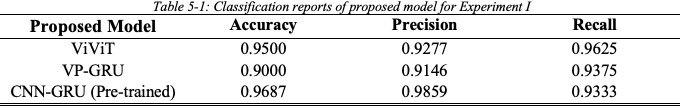
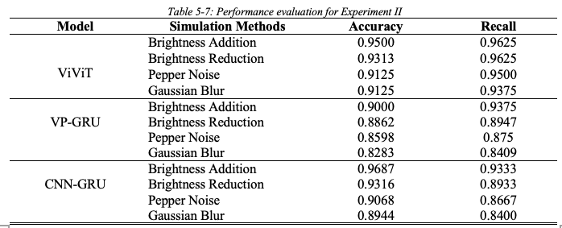
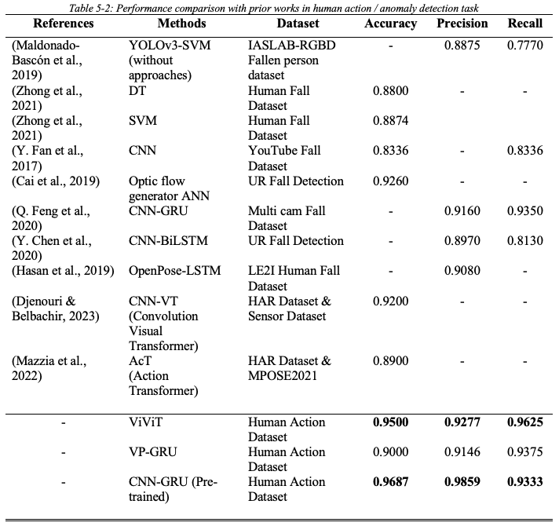

# Human-Anomaly-Detection
## Overview

This project introduces a novel variation of the Vision Transformer (ViT) called the Video Vision Transformer (ViViT). This model enables the encoder to perform feature extraction within both spatial and temporal domains for detecting anomalous human actions. The paper also presents two distinct hybrid models: the ViTPose Gated Recurrent Unit (VP-GRU) model and the Pretrained Inception V3 Gated Recurrent Unit (CNN-GRU) model. The VP-GRU model leverages human pose features for anomaly detection, while the CNN-GRU model relies on spatial features extracted by the CNN then follow with a temporal features model to identify anomalies. Furthermore, two different experiments have been carried out to evaluate the acoustic classification performance of the human anomality. 

## Some Key terms
- ViViT (Video Vission Transformer)
- VP-GRU (ViTPose GRU)
- CNN-GRU (Inception V3 Pretrained)
- Data set: [kaggle link](https://www.kaggle.com/datasets/ngoduy/dataset-video-for-human-action-recognition)
- Train environment: T4 GPU x2 (32 GB ram in total)
- GUI interface framework: streamlit

# Folders Breakdown
- `Dataset`: Include the test and training dataset been used. (NOTES: Test inside this folder is for demo)
- `Model`: Essential code for post preprocessing on model loading
- `Saved_model` Ready for loading (.keras format)
- `Uploads`: For user to upload `test` files from the interface

# Setup
- `git clone` this repo
- `pip install -r requirements.txt`
- Make sure you have cloned `easy_ViTPose` if no here is the [links to access](https://github.com/JunkyByte/easy_ViTPose)
    - Read thru the `./Model/VP_GRU.py` some of the modification should be done while first time running it
    
# Result & Discussion
## Experiment I
Experiment I involved using test data that we split earlier to evaluate your model's performance. This is to determine the model's predictoin accuracy on an unseen dataset. 

## Experiment II
In this experiment, the previously used test dataset will be subjected to various noise conditions, simulating real-world scenarios. To achieve this, the video augmentation techniques provided by the [vidaug](https://github.com/okankop/vidaug) will be employed. The aim of this experiment is to determine which model perform better under real-world conditions

## Baseline Model
Here are some of baseline model had been proposed by prior researchers

## Summary
- VP-GRU faced issues in extracting human pose in the Experiment II (Pepper noise, Reduced brightness and Gaussian blur effect) & not only that the processing time of ViT-Pose are extremely slow even with the proposed Flatten GRU (new variation GRU we proposed in this project) the overall detection speed are still longer compare to other model.

- Pre-train model had the highest accuracy and percision however the recall is some what lower than other proposed model. NOTES: higher recall is crucial because it ensure that as many actual falls as possible are detected, missed falls or false negatives can lead to cirtical safey issues. Additionaly, the model recall dropped to below 90% during the Expriment II. 

- As a results demonstrate that the proposed ViViT model outperforms the other models, by consistently achieving superior detection scores across both experiments. Nonetheless, the VP-GRU and CNN-GRU models also show better performance compared to the baseline models. 

# Deployment

# Future improvement
- Considering 3D Depth Video Data
- Play around with 3D ViT-Pose Techniques + 2 channel video try speed up the detection speed
- Tuning on Inception V3 Pretrained Model (Freezing layer techniques)